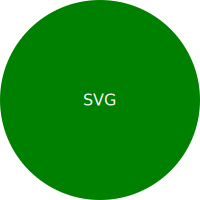

# Logo-Generator

A Node.js command-line application to generate simple SVG logos.

  
*Sample SVG logo generated using the application.*

## Description

This application prompts the user for a series of inputs to customize their logo: text (up to three characters), text color, shape (circle, triangle, or square), and shape color. Once all the information is provided, the application generates an SVG logo and saves it as `logo.svg`.

## Usage

1. Clone the repository: 
`git clone <https://github.com/keybit-1/Logo-Generator.git>`

2. Install the required npm packages:
`npm install`

3. Run the application:
`node index.js`

4. Follow the on-screen prompts to customize your logo.

5. Once the logo is generated, you can find the SVG file at `./examples/logo.svg`.

## Walkthrough Video

For a full demonstration of the application's functionality and tests, please refer to the [walkthrough video](#).

## Technologies Used

- Node.js
- Inquirer
- Jest

## License

This project is licensed under the MIT License.

## Acknowledgements

- Jest for testing capabilities.
- Inquirer for user input handling.
